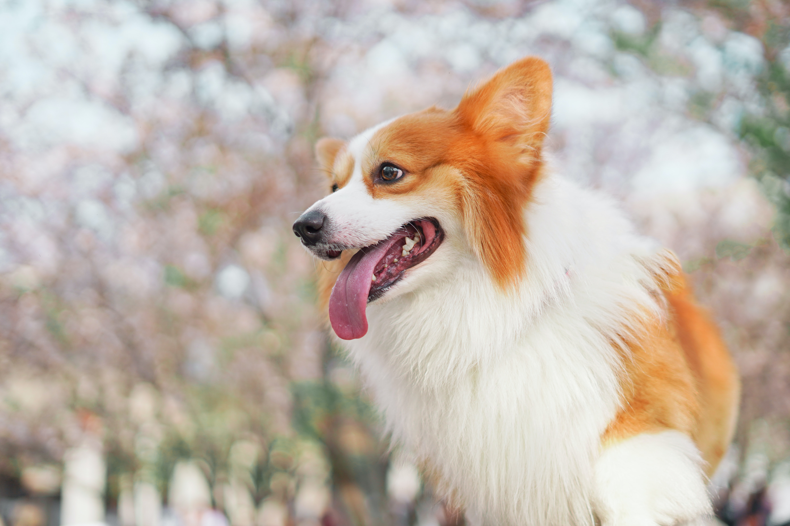

For my first post, I decided to write about a tool that I always use gladly when mockup new websites. So here I would like to share with you my favorite image and video placeholder [Place Corgi](http://placecorgi.com/). As you can guess I am a Corgi lover and this image placeholder is just perfect for me, and everyone who loves dogs and especially Corgis.

It is easy to use, just a link to Place Corgi site with a width and optional height specified after the URL.
`http://placecorgi.com/width/height`

Also, we can place a video as a placeholder. To do that, we would add /v to the URL along with width and height
`http://placecorgi.com/v/width/height`

You can add the Place Corgi js file to your application, which will automatically replace any img tags that have the class corgi with images from Place Corgi.
For this implementation visit site [here](http://placecorgi.com/).
