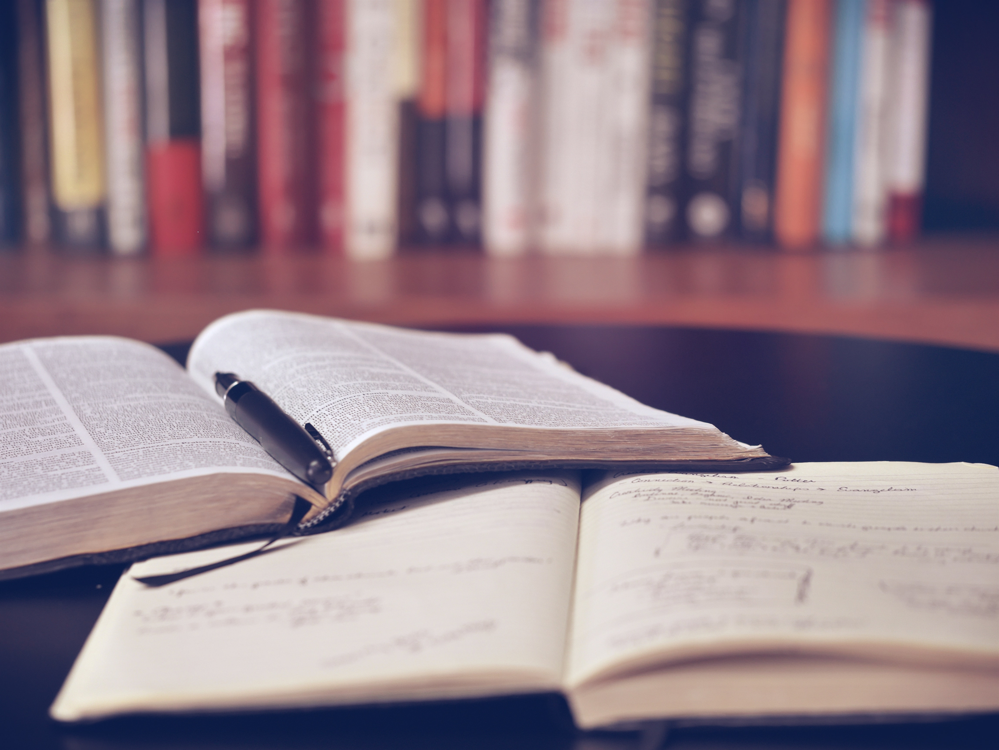

Usually, we don't know how to study. When we study there are three mistakes that we all do.
The first mistake is that we go to class and wait for teachers to teach us.

> “Without going into learning theory as psychologists conceive it, it is obvious that teaching is a very special art, sharing with only two other arts - agriculture and medicine - an exceptionally important characteristic. A doctor may do many things for his patient, but in the final analysis it is the patient himself who must get well - grow in health. The farmer does many things for his pants or animals, but in the final analysis, it is they that must grow in size and excellence. Similarly, although the teacher may help his student in many ways, it is the student himself who must do the learning. Knowledge must grow in his mind if learning is to take place.”
>
> Mortimer J. Adler - How to read a book

Did you learn to play the piano just looking your teacher how he or she plays it and you said: “Yes, now I know how to play it myself”? I guess you didn’t. You need to practice a lot. Your teacher is there to focus your attention on what you need to learn, what are the steps, to answer your questions (but you need to have questions), choose tasks you need to do (which will help you in your learning), and measure your progress (exams are one example of measuring your progress). The learning process you need to do alone. Initiative, activity, and managing of your learning are in your hands. One advice here is to every learning session start with a question. When you get the answer, we need to do one crucial thing and write it down. Write your question and answer and repeat this in a circle.

The second mistake is that when you got your answer, you said: “Ok, now I know, I understand, I will know this forever”. But in reality, you don’t know. Our memory system is not that good for storing new information. Our brain has a tendency to forget and change our memories. And the solution for this is to write the answer.

Why do you need to write? The aim here is not to write everything from presentation, blackboard or from someone else. We need to write our own thoughts, interpretation of new information, reflections, conclusions, questions, and new ideas. We should write everything that we want to remember, so we have some hard copy on paper to help us later when we forget what we wanted to remember permanently.

The third biggest mistake we make is we said: “Ok, I understand so I know. Everything is clear to me. I don’t need to exercise.”

How do we learn? By solving a lot of tasks - different tasks, applying what we have learned, discussing what we already learned: specifics, where to apply, what are our limitations. That’s how we learn.

It's not a problem if you don't know something the problem is if you let it stay that way, we all don't know something or we can't remember, but we have to ask. Resolve this immediately. Do not wait to solve it one day before the exam.

After every learning session. Think, summarize, and record what you have learned. Take a piece of paper and write what you have learned. There is one technique that you can use here, while you are learning or taking notes during the class:

1. What you already knew, but now you remembered, e.g. put a plus sign **(+)**.
2. What you thought different before, e.g. put a minus sign **(-)**.
3. What is new and important, e.g. put the exclamation point **(!)**.
4. What is still not clear to you, e.g. put a question mark **(?)**.

This technique is also good for you when reading books.

## Good study organization

### How to organize your study?

1. Prepare for each class: read the lesson in advance, write your questions.

e.g. Imagine we have to spend 3 hours to learn something, of which 1 hour of lectures. Is it better to listen to a 1-hour lecture and then sit for 2 hours learning from a book alone? Or is it better that you spend an hour reading a book, then an hour of lectures, then again an hour reading a book? In the second scenario, you sit down alone for an hour reading a lesson, watching presentations and writing questions for things you don’t understand. Then you’re ready for the lecture. In the lecture, you will get answers to questions that you would normally have in the first version after the second hour.

2. Be active during the lecture: seek answers to your questions, ask your questions aloud, do whatever the teacher tells you, and write.

When you are attending the class, be prepared for the class. If not, go to the gym, make love behind the school. But if you go to class, then better listen to what your teacher is saying than typing SMS. If you are in the class but you are bored, and you are typing SMS you are creating yourself a lack of serotonin, creating a feeling of failure, reduce your will for learning.

3. Summarize the lessons in your own words what you have learned.
4. Exercise: Solve tasks, discuss with colleagues, with the teacher, online.
5. Ask your questions right away: don't wait for exams or for better times. The best time to ask a question is when you have one.
6. Continually test your knowledge with some tasks, exercises, mini-projects, online if there is a discussion with colleagues. When you recognize that you are missing some knowledge, learn that immediately. Apply what you have learned… teach other students, teach high school students, and work on projects.
7. Build your library systematically, printed and digital materials, links from which you learned. For this, you can use [Notion](https://www.notion.so/Get-Started-e094db305f524d0282549db5a0dea4f2), [Evernote](https://evernote.com/), [Zotero](https://www.zotero.org/), Google Docs, etc.
